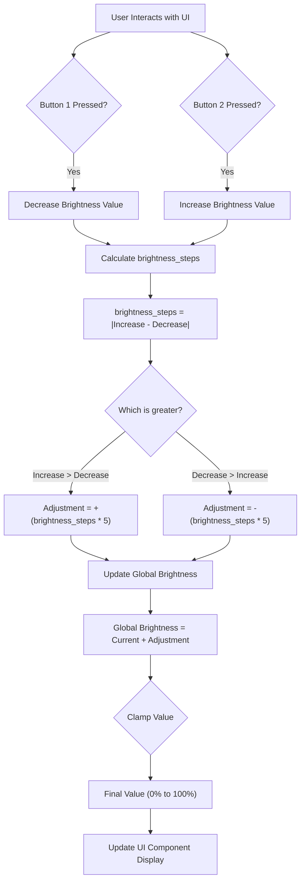

# Change Request v4 — Dynamic Button-Count Brightness Calculation

**Date:** 2026-03-12
**Status:** Implemented
**Target File:** `index.html`
**References:** `instructions/02_ble_protocol.md` — Notify Payload & Adaptive Brightness Logic

---

## Overview

Button-count-based brightness calculation that dynamically updates `#brightness-val` based on the delta between two physical button counters received via BLE notify packets.

- **Button 1** = Decrease Brightness (each press decrements by 5%)
- **Button 2** = Increase Brightness (each press increments by 5%)

---

## Flow Diagram



---

## CR-07: Brightness Calculation from Button Counts

### Data Source (from `02_ble_protocol.md`)

The device sends a `0xCC` notify packet every ~1 second:

```
0xCC [Battery] [Button1_Count] [Button2_Count]
```

- `Button1_Count` — cumulative press count for **Decrease Brightness**
- `Button2_Count` — cumulative press count for **Increase Brightness**

### Calculation Logic

**Inputs:**
- `lastBtn1` — Button 1 count (Decrease Brightness)
- `lastBtn2` — Button 2 count (Increase Brightness)
- `commandedBright` — baseline brightness % from the last sent `0xBC` command

**Step Value:** Each step = 5%

**Formula:**

```
brightness_steps = |lastBtn2 - lastBtn1|
sign = +1 if lastBtn2 > lastBtn1, -1 if lastBtn1 > lastBtn2, 0 if equal
adjustment = sign * brightness_steps * 5
Global Brightness = clamp(commandedBright + adjustment, 0, 100)
```

**Examples:**

| commandedBright | Decrease (Btn1) | Increase (Btn2) | brightness_steps | Adjustment | Global Brightness |
|-----------------|-----------------|-----------------|------------------|------------|-------------------|
| 50% | 3 | 5 | 2 | +10% | 60% |
| 50% | 5 | 3 | 2 | -10% | 40% |
| 10% | 1 | 20 | 19 | +95% | 100% (clamped) |
| 10% | 5 | 0 | 5 | -25% | 0% (clamped) |

### State Variables

| Variable | Type | Default | Purpose |
|----------|------|---------|---------|
| `lastBtn1` | `number` | `0` | Button 1 count (Decrease Brightness) |
| `lastBtn2` | `number` | `0` | Button 2 count (Increase Brightness) |
| `commandedBright` | `number` | `10` | Brightness % from last `0xBC` command sent |
| `totalBrightness` | `number` | `10` | Global brightness (commanded + adjustment), clamped 0-100 |
| `hasReceivedFirstNotify` | `boolean` | `false` | Guards first-packet baseline snapshot |

---

## CR-08: Brightness UI Display

### UI Components

The brightness card (`#brightness-card`) shows:
- `#brightness-val` — Global brightness as percentage (e.g. "60%")
- `#brightness-bar` — Visual progress bar reflecting global brightness

Both update in real-time on every BLE notify as button counts change.

### Removed Components

The following old UI elements have been removed:
- `#brightness-detail` — formula text display
- `#bright-inline-row` — Previous/New inline values on brightness card
- `#bright-history-card` — Separate brightness history card

---

## CR-09: Pattern Builder Integration

### Hex Overwrite

When a Pattern Builder sequence is playing, apply the button offset to each pattern step:

```
effectiveBrightness = clamp(pattern.brightness + ((btn2 - btn1) * 5), 0, 100)
```

The `effectiveBrightness` overwrites the brightness byte (`cmd[5]`) in the `0xBC` command sent for each pattern step.

### Adaptive Re-send During Sequence

When buttons are pressed during sequence playback, immediately re-send the active pattern step with the updated brightness.

### Non-Sequence Adaptive Re-send

When buttons are pressed outside of sequence playback, re-send the last active `0xBC` command (preset or manual) with the updated `totalBrightness`.

### Constraint

Brightness byte must always be clamped **0–100** to avoid invalid HEX generation.

---

## CR-10: Disconnect Reset

On device disconnect, reset all brightness state:

```js
lastBtn1 = 0;
lastBtn2 = 0;
commandedBright = 10;
totalBrightness = 10;
hasReceivedFirstNotify = false;
```

Reset `#brightness-val` to `—` and `#brightness-bar` to 0%.

---

## Implementation File Map

| File | Area | Change |
|------|------|--------|
| `index.html` | Button labels HTML | Renamed Button 1 → "Decrease Brightness", Button 2 → "Increase Brightness" |
| `index.html` | State variables | `lastBtn1`, `lastBtn2`, `commandedBright`, `totalBrightness`, `hasReceivedFirstNotify` |
| `index.html` | Brightness card HTML | Simplified to `#brightness-val` + `#brightness-bar` only |
| `index.html` | `recalcBrightness()` | Uses `brightness_steps`, sign logic, adjustment formula |
| `index.html` | `onNotify()` | Brightness calculation, UI update, adaptive re-send with `(btn2 - btn1) * 5` |
| `index.html` | `sendCommand()` | Track `commandedBright` from `cmd[5]`, recalculate total |
| `index.html` | `sendCurrentPattern()` | Apply `(btn2 - btn1) * 5` offset to `p.brightness` |
| `index.html` | `setConnected(false)` | Reset all brightness state |
